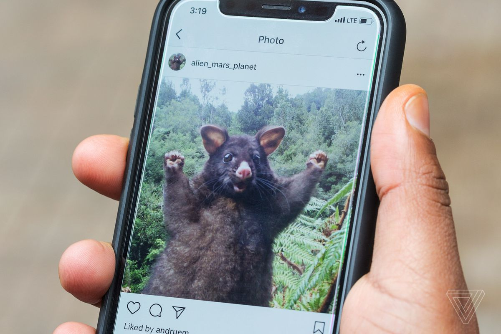

# Intro to PICO-8

Jason Tu (@nucleartide)

---

import { Appear } from 'mdx-deck'

  <Appear>
    

      
    

    

      
    

    

      
    

    

      
      
    

  </Appear>

---

<video src="./commodore.mp4" autoPlay muted loop></video>

---

Mr. zep ☝

---

---

import { TwitterTweetEmbed } from 'react-twitter-embed'

<TwitterTweetEmbed tweetId="1068689096636133376" />

---

## Demo

---

<video src="./pico_gifs.m4v" width="500" autoPlay muted />

---

## Conclusion

Capture creative ideas, share them with people

